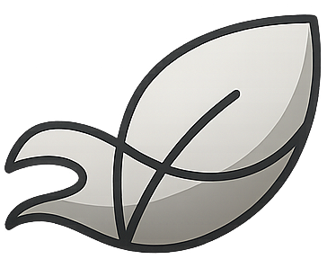

  

<h1 align="center">Feflow UI</h1>

**feflow** is a lightweight and dependency-free UI component library.

> Minimal, accessible, dependency-free — made by a developer who loves clean UI.

## Why feflow?

- Lightweight by design
- Isolated styles using CSS Modules — no bleeding styles
- Simple to read, simple to use

## Features

- **Zero external dependencies**
- **Scoped styles with CSS Modules** (no global conflicts)
- Optional integration with Tailwind (not required)
- **Easy theme customization** — built to support theming out-of-the-box
- **Dark and Light themes included** by default, switchable via simple props or CSS variables
- Fully typed with TypeScript
- Component slots and customizable props
- Built for developer experience (DX)

## Documentation

Coming soon in the [https://feflow-ui.dxdns.dev/docs](https://feflow-ui.dxdns.dev/docs).

## Contributing

Please see the [Contributing Guide](CONTRIBUTING.md) for information on contributing to feflow.

## License

MIT — free for personal and commercial use.

## Credits

Built by [@dxdns](https://linkedin.com/in/dxdns).

Inspired by the work of [MUI](https://mui.com), [shadcn/ui](https://ui.shadcn.com) and [Chakra UI](https://chakra-ui.com).

Icons: [Material Icons](https://fonts.google.com/icons)
